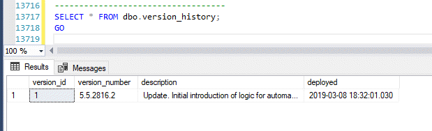
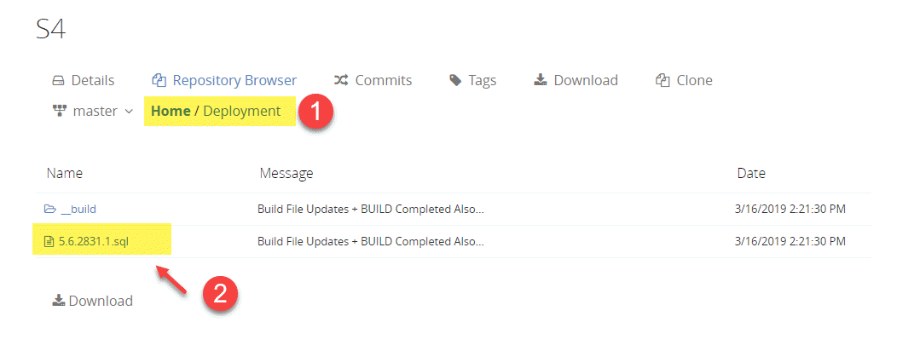
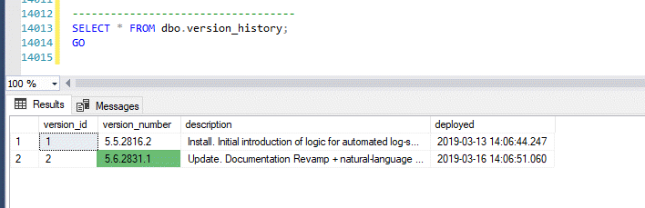

# SETUP AND DEPLOYMENT
## S4 Documentation
* **Setup and Installation**

* [Examples (Features and Benefits)](/Repository/Blob/00aeb933-08e0-466e-a815-db20aa979639?encodedName=feature~2f5.6&encodedPath=Documentation%2FFEATURES.md)
* [Using S4 (Conventions and Best Practices)s](/Repository/Blob/00aeb933-08e0-466e-a815-db20aa979639?encodedName=feature~2f5.6&encodedPath=Documentation%2FCONVENTIONS.md)
* [APIs (Detailed Documentation)](/Repository/Blob/00aeb933-08e0-466e-a815-db20aa979639?encodedName=feature~2f5.6&encodedPath=Documentation%2FDOCS.md)

### <a name="toc"></a>Setup and Installation:
- [S4 Deployment](#setup)
- [Updating Existing S4 Deployments](#update)
- [Enabling Advanced Features](#advanced)

### <a name="setup"></a>S4 Deployment

#### Requirements
- SQL Server 2008+. NOT everything in S4 works with SQL Server 2008/R2 - but all S4 functionality IS intended to work with SQL Sever 2012+.
- Ability to run T-SQL against SQL Server and create a database ([admindb]).
- Advanced Error Handling (required for backups + automated restore tests and many other 'advanced' S4 features) require xp_cmdshell to be enabled - as outlined [below](#advanced).
- SMTP (Database Mail) for notifications and alerts when using advanced/automated S4 features.

#### What to Expect
- Find and execute latest.version.sql (e.g., 5.5.2816.2.sql) in the \Deployment\ folder for this repository.
- Execution of latest.version.sql will create a new database: [admindb].
- All code/logic needed for S4 functionality will be deployed into [admindb]. 
- ***Optionally:** Once the [admindb] has been created, you can enable [advanced error handling capabilities](#advanced) - which are needed to enable S4 Backups, S4 Restores, and other advanced functionality.* 

#### Step by Step Deployment Instructions
To deploy S4 to a target SQL Server Instance:
1. Locate the latest version of S4 in the [Deployment](/Repository/Blob/00aeb933-08e0-466e-a815-db20aa979639?encodedName=feature~2f5.6&encodedPath=Deployment) folder. By convention, only the latest and most-up-to-date version of S4 will be in the Deployment folder (and will use a min.max.signature.build.sql file format - e.g.., "5.5.2816.2.sql"). 


2. Run/Execute the contents of the latest-version.sql (e.g., "5.5.2816.2.sql") file against your target server. 
3. The script will do everything necessary to create a new database (the [admindb]) and populate it with all S4 entities and code needed. 
4. As script execution completes, information about the current version(s) installed on your server instance will be displayed. 



**NOTE:** *If S4 has already been deployed to your target SQL Server Instance, the deployment script will detect this and simply UPDATE all code in the [admindb] to the latest version - adding a new entry into admindb.dbo.version_history.* 

[Return to Setup Table of Contents](#toc)

### <a name="update"></a>Updating Existing S4 Deployments
Once S4 has been deployed, keeping it updated is simple: 
1. As with a new installation/deployment, simply locate the latest.version.sql file (e.g., "5.6.2820.1.sql") in the [Deployment](/Repository/Blob/00aeb933-08e0-466e-a815-db20aa979639?encodedName=feature~2f5.6&encodedPath=Deployment) folder,



2. Execute it against your target SQL Server Instance. 
3. The script will do everything necessary to update all code, tables, and other stuctures/entities needed to push your code to the latest version of S4 goodness. 
4. Upon completion, the update/deployment script will output information about all versions installed on your target server instance:




[Return to Setup Table of Contents](#toc)

## <a name="advanced"></a>Enabling Advanced Features 

Once S4 has been deployed (i.e., after the admindb has been created), to deploy advanced error-handling features, simply run the following: 

```sql
EXEC [admindb].dbo.[enable_advanced_capabilities];
GO
```

[And to undo, execute dbo.disable_advanced_capabilities. Likewise to view/verify whether capabilities are on or not: EXEC dbo.verifiy_advanced_capabilities.]

*[-- TODO: document this fully as part of the v6.0 release (as that's where enabling xp _cmdshell will be removed from normal installation/deployment and become an OPTIONAL feature that can be enabled within the admindb itself (well, via the admindb - cuz it'll enable xp _cmdshell across the server if/as needed.)
v6.0 is where xp_cmdshell enabling will be 'split' out from the main deployment process into a sproc that'll report on the current setting, provide some info/docs/"don't panic details", and enable sp _ configure functionality.]*


[LINK to CONVENTIONS about how S4 doesn't want to just 'try' things and throw up hands if/when there's an error. it strives for caller-inform. So that troubleshooting is easy and natural - as DBAs/admins will have immediate access to specific exceptions and errors - without having to spend tons of time debugging and so on... ]

### TRY / CATCH Fails to Catch All Exceptions in SQL Server
[demonstrate this by means of an example - e.g., backup to a drive that doesn't exist... and try/catch... then show the output... of F5/execution.]

[To get around this, have to enable xp_cmdshell - to let us 'shell out' to the SQL Server's own shell and run sqlcmd with the command we want to run... so that we can capture all output/details as needed.] 

[example of dbo.execute_command (same backup statement as above - but passed in as a command) - and show the output - i.e., we TRAPPED the error (with full details).]

[NOTE about how all of this is ... yeah, a pain, but there's no other way. Then... xp_cmdshell is native SQL Server and just fine.]


### Common Questions and Concerns about enabling xp_cmdshell 
Meh. There's a lot of [FUD](https://en.wikipedia.org/wiki/Fear,_uncertainty_and_doubt) out there about enabling xp_cmdshell on your SQL Server. Security is NEVER something to take lightly, but xp_cmdshell isn't a security concern - having a SQL Server running with ELEVATED PERMISSIONS is a security concern. xp_cmdshell merely allows the SQL Server Service account to interact with the OS much EASIER than would otherwise be possible without xp_cmdshell enabled. 

For more detailed information, see [Notes about xp_cmdshell](/Repository/Blob/00aeb933-08e0-466e-a815-db20aa979639?encodedName=feature~2f5.6&encodedPath=Documentation%2Fxp_cmdshell_notes.md)

[Return to Setup Table of Contents](#toc)


