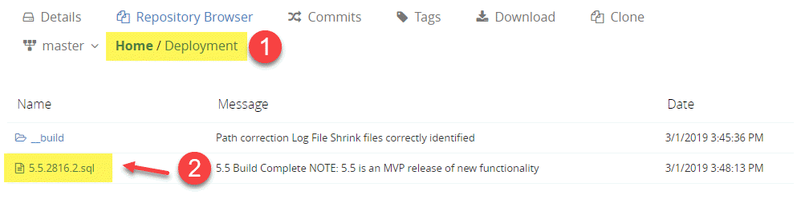

# SETUP AND DEPLOYMENT
-- TODO: links to other 'high level docs pages'... 

-- TODO: create links/toc... for the details below... 
#### Table of Contents
- S4 Deployment
- Updating existing S4 Deployments
- Enabling Advanced Features

## What to Expect
- A single S4 .sql script will create an **[admindb]** on your target server instance. 
- All S4 code and functionality will then be deployed into the [admindb]. (So that it's not 'creeping around' in any of your other databases (including [master] - and so that you can easily remove S4 if you no longer want it on your system.)
- Optionally, once deployed, you can enable advanced S4 error handling capabilities - which require a potential change to server configuration (to allow the error handling needed to facilitate backups, restore-tests, and other advanced operations).

## Step by Step Deployment Instructions
To deploy S4 to a target SQL Server Instance:
1. Locate the latest version of S4 in the Deployment folder. By convention, only the latest and most-up-to-date version of S4 will be in the Deployment folder (and will use a min.max.signature.build.sql file format - e.g.., "5.5.2816.2.sql"). 

2. Run/Execute the contents of the latest-version.sql (e.g., "5.5.2816.2.sql") file against your target server. 
3. The script will do everything necessary to create a new database (the [admindb]) and populate it with all S4 code and entities needed. 
4. As script execution completes, information about the current version(s) installed on your server instance will be displayed. 

**NOTE:** *If S4 has already been deployed to your target SQL Server Instance, the deployment script will detect this and simply UPDATE all code in the [admindb] to the latest version - adding a new entry into admindb.dbo.version_history.* 

## Step by Step Updating Instructions
Once S4 has been deployed, keeping it updated is simple: 
1. As with a new installation/deployment, simply locate the latest.version.sql file (e.g., "5.6.2820.1.sql")

-- TODO: insert an image of 5.6 or 5.7 in the repo... 

2. Execute it against your target SQL Server Instance. 
3. The script will do everything necessary to update all code, tables, and other stuctures/entities needed to push your code to the latest version of S4 goodness. 
4. Upon completion, the update/deployment script will output information about all versions installed on your target server instance.

-- TODO: insert an image showing the last N versions on a target instance.

## Enabling Advanced Features 
[v6.0 is where xp_cmdshell enabling will be 'split' out from the main deployment process into a sproc that'll report on the current setting, provide some info/docs/"don't panic details", and enable sp _ configure functionality. ]

-- TODO: document this fully as part of the v6.0 release (as that's where enabling xp_cmdshell will be removed from normal installation/deployment and become an OPTIONAL feature that can be enabled within the admindb itself (well, via the admindb - cuz it'll enable xp_cmdshell across the server if/as needed.)

[LINK to CONVENTIONS about how S4 doesn't want to just 'try' things and throw up hands if/when there's an error. it strives for caller-inform. So that troubleshooting is easy and natural - as DBAs/admins will have immediate access to specific exceptions and errors - without having to spend tons of time debugging and so on... ]

### TRY / CATCH Fails to Catch All Exceptions in SQL Server
[demonstrate this by means of an example - e.g., backup to a drive that doesn't exist... and try/catch... then show the output... of F5/execution.]

[To get around this, have to enable xp_cmdshell - to let us 'shell out' to the SQL Server's own shell and run sqlcmd with the command we want to run... so that we can capture all output/details as needed.] 

[example of dbo.execute_command (same backup statement as above - but passed in as a command) - and show the output - i.e., we TRAPPED the error (with full details).]

[NOTE about how all of this is ... yeah, a pain, but there's no other way. Then... xp_cmdshell is native SQL Server and just fine.]

### Common Questions and Concerns about enabling xp_cmdshell 
[meh... commands execute with the same perms that could be used by the server. if your server's service account has too much power/permission, then THAT is your problem and it can/will be exploited. xp_cmdshell doesn't change that vulnerability - it simply makes it EASY for anyone familiar with SQL Server to run commands. ]

[find the other/existing 'docs' i have already defined for xp_cmdshell and integrate them here... ]

